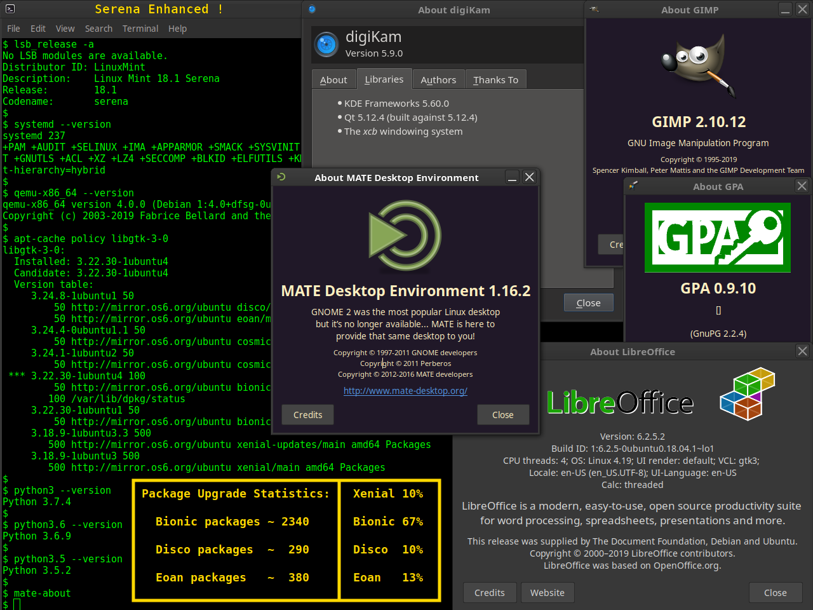

# [ubuntu-rolling](https://github.com/savoury1/ubuntu-rolling)
### Ubuntu "Rolling Release" System

To make a customized "hybrid" Ubuntu Xenial-based system that includes selected packages from newer Ubuntu series. There are many reasons to want to do this including:

* Maintain an up-to-date Ubuntu-based system without having to do full system upgrades periodically (a process that often results in many software programs no longer working, due removal of dependencies in the new version)

* Retain what is good from earlier Ubuntu-based distributions (ie. a fast and lightweight GTK2 based desktop such as in Linux Mint 18.1 Serena MATE) while also being able to use what is good and useful from newer Ubuntu series

* Learn about the system you are using by gaining an understanding of the various software packages installed and their inter-relationships, such that you are also better equipped to fix problems as and when they might occur

### Some Philosophical Background

These procedures have specifically been created using a starting point of Linux Mint Serena 18.1 MATE (a Xenial-based Ubuntu distribution) as it has a GTK2 based desktop. Note the quote in the center of the screenshot below (MATE 1.16.2 "about" box):

> GNOME 2 was the most popular Linux desktop but it's no longer available... MATE is here to provide that same desktop to you!

Question: if GNOME 2 was the most popular desktop, **why** is it no longer available?

Based on all testing of GNOME 3 it is overly complex, [bug-ridden](https://igurublog.wordpress.com/2012/11/05/gnome-et-al-rotting-in-threes/) [garbage](https://fosspost.org/opinions/are-gtk-developers-destroying-linux-desktop-with-their-plans) and yet this is the desktop base that Canonical have now chosen for Bionic and onwards! Even Clem (the main guy behind Linux Mint), who was known to rant about breakages caused by GNOME 3 and GTK3 a few years back, decided that from Mint 18.2 the MATE desktop would be based on GTK3!?!

Also, the obvious arrogance of the GNOME 3 developers is indicative of trends within the entire software industry (both proprietary and "free"). Those trends for some years now (at least with a number of software development teams, though certainly not all) are to consistently ignore user feedback, strip features from newer releases, change paradigms about how core parts of the system (such as the desktop environment) has worked for years, all because "I'm the developer and say it's better!" This "dumbing down" in the name of "progress" with rapidly released new versions all about "new features" is actually destroying the reliability of computer software on the whole.

This coming from someone who has done paid tech support work since his mid-teens in the late 1980s (DOS based systems) and for 30 years since. So this includes with all iterations of Windows (to the level of Server Engineer designing and installing web server farms hosting sites with millions of hits per day), many iterations of OS X, many iterations of Linux, and even some genuine UNIX systems.

Personally, the long overdue switch from Windows to a Linux distribution as the day-to-day OS (prompted by the user-hostile, spyware ridden, forced updates garbage known as "Windows 10") happened at exactly the point when Mint 18.1 Serena had just been released. And it had a fast, usable GTK2 based desktop.

This was serendipitous timing. After Mint 18.2 MATE was released and having done some testing of that version (with the "new, improved" GTK3 based desktop garbage), it was clear that Mint 18.1 was going to be the way forward for a long time. Thus, a procedure had to be created to allow upgrading core "modules" or sub-systems of the OS, without touching the simple, fast, usable GTK2 based desktop. Hence, the Ubuntu (Xenial-based) "Rolling Release" system, specifically crafted on a Mint 18.1 Serena MATE installation.

#### Friendly disclaimer

Please do note that this Ubuntu Xenial-based "Rolling Release" system is a "work in progress" and it is useful to state up front:

*The procedures contained on this site might break your system completely and should only be followed by people with appropriate technical backgrounds. This includes a good understanding of the Debian package management system (using "apt" commands), as well as at least a fair understanding of terminal commands and shell scripting. Any system breakage that occurs due carrying out any procedures on this site is entirely the responsibility of the person(s) carrying out those procedures.*

This version table gives an idea of the newer versions that can be installed on a Xenial-based distribution, through this modular upgrade process (yes, GTK3 is mentioned, as new GTK3 libraries are unfortunately needed :-( to run much new software, even if the desktop itself is not based on GTK3!):

System component | Xenial version | Bionic upgrade | Cosmic upgrade | Disco upgrade | Eoan upgrade
---------------- | -------------- | -------------- | -------------- | ------------- | ------------
C libraries | 2.23 | 2.27 | 2.28 | 2.29 | 2.29
systemd | 229 | 237 | 239 | 240 | 240
GTK3 | 3.18.9 | 3.22.30 | 3.24.4 | 3.24.8 | 3.24.8
GPG | 1.4.20 | 2.2.4 | 2.2.8 | 2.2.12 | 2.2.12
X.Org X Server | 1.18.4 | 1.19.6 | 1.20.1 | 1.20.4 | 1.20.4
KDE libraries (apps) | 5.18.0 (2.0.3) | 5.44.0a (17.12.3) | 5.50.0 (18.04.3) | 5.56.0 (18.12.3) | 5.60.0 (19.04.3)
Qt libraries | 5.5.1 | 5.9.5 | 5.11.1 | 5.12.2 | 5.12.4

*This screenshot is from the test system used for creating these procedures (as at Aug 10th, 2019). As can be seen, there is a mix of packages from four Ubuntu "series" currently installed, including approximately 2/3rd Bionic, 1/10th Disco and 1/8th of the system being from the yet-to-be-released Eoan (shipping Oct 17th, 2019)!*

Many new software packages especially require newer KDE/Qt libraries than can be installed from the Xenial repositories. For instance, digiKam (excellent photo management software) 5.9.0 (a very stable version) requires Qt 5.9 making it impossible to run a native version of this program on Xenial systems. An AppImage is provided on the digiKam website that works well, however, many programs that similarly require newer Qt libraries than in Xenial do not have an AppImage available, so being able to actually upgrade the system Qt libraries to a much newer version is very advantageous.

Additionally relative to Qt, the qt5ct tool that allows consistent theming of Qt applications does not work until Qt 5.7 meaning that the visual appearanace of all Qt applications on pure Ubuntu Xenial systems can not be defined by the user. An annoying fact when using various Qt based software such as VirtualBox Manager. By upgrading Qt to the Bionic version, a Xenial-based system can then use qt5ct to define themes, font sizes and more in a consistent fashion for all Qt applications. If you like to have dark themes with light text (much better for the eyes and brain!) then Qt 5.7+ is therefore a must.

#### Overall Procedure

* Install Xenial-based system of choice (or backup existing Xenial-based install if wanting to enhance current system), though Linux Mint 18.1 Serena MATE is a recommended starting point due these procedures being created on that distribution

* Run `enhanced-packages-serena` (or `enhanced-packages-xenial` if using a Xenial-based distro other than Serena MATE) script to create a handful of useful custom packages that fix certain issues after the enhancement process

* Run `enhancements-serena` (or `enhancements-xenial`) script to install various PPAs, upgrade various system components with Xenial versions and then call `enhancements-1st-run` (which installs about new 3,000 packages with one apt command)

* Customize and modify the plain text package list files when needed, to choose required packages from newer Ubuntu series (paying attention to package inter-dependencies)

* After customizing the package list files, run `enhance-scripts-make` to create a script `enhance-all` that can then be run periodically to keep all the selected packages from newer series up-to-date!

*See the readme file in the script directory for more detailed information and "how tos" relative running these procedures.*
